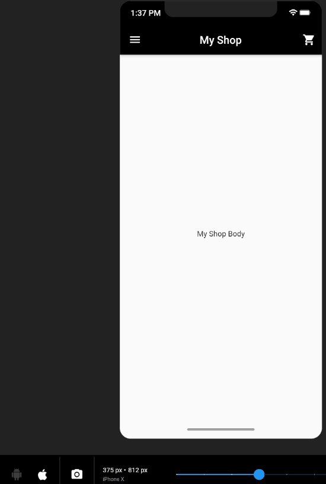
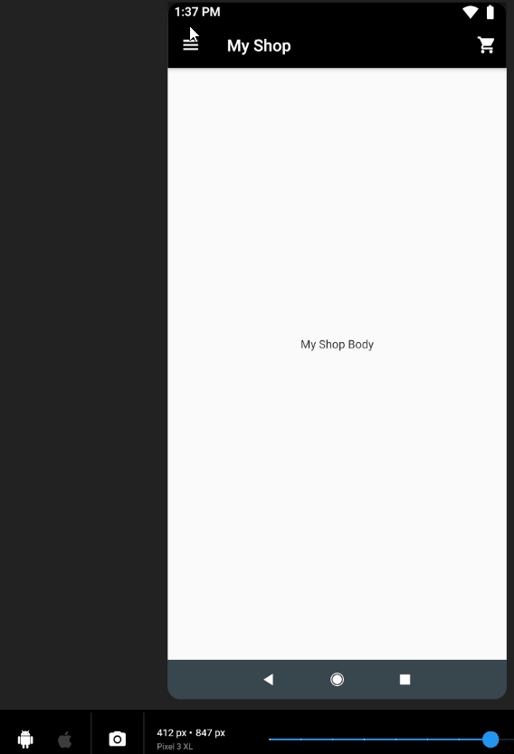

# Flutter Workshop

[](https://github.com/Jadhielv/flutter-workshop/blob/master/LICENSE)


[](https://github.com/jadhielv?tab=followers)
[](https://twitter.com/intent/follow?screen_name=jadhielv)

A new Flutter project.

## Getting Started

This project is a starting point for a Flutter application, sponsored by [GDG Santo Domingo](https://github.com/gdgsantodomingo) community.

### How to Use

**Step 1:**

Download or clone this repo by using the link below:

```
https://github.com/Jadhielv/flutter-workshop.git
```

**Step 2:**

Go to project root and execute the following command in console to get the required dependencies: 

``` 
flutter pub get 
```

**Step 3:**

Run the project: 

``` 
flutter run
```

**Step 4:**

To serve your app from localhost in Chrome, enter the following from the top of the package: 

``` 
flutter run -d chrome
```

**Note:** *If there aren’t any other connected devices, the -d chrome is optional.*

<br/>

**Step 5:**

To launch your app from the command line, enter the following from the top of the package:

``` 
flutter run -d windows
```

**Note:** *If there aren’t any other connected devices, the -d windows is optional.*

### Preview

<br/>

<div align="center">
    
        &nbsp;&nbsp;&nbsp;&nbsp;
    
</div>

<br/>

## Workshop Features:

* IDE DevTools
* Project Structure
* Emulators (iOS simulator, Android emulator)
* Dart Language
* Routing & Navigation
* Web & Desktop Support

## Contact

If you want to contact me you can reach me at <jadhielv@gmail.com>

## License
<!--- If you're not sure which open license to use see https://choosealicense.com/--->

This project uses the following license: [MIT](<https://choosealicense.com/licenses/mit/>)